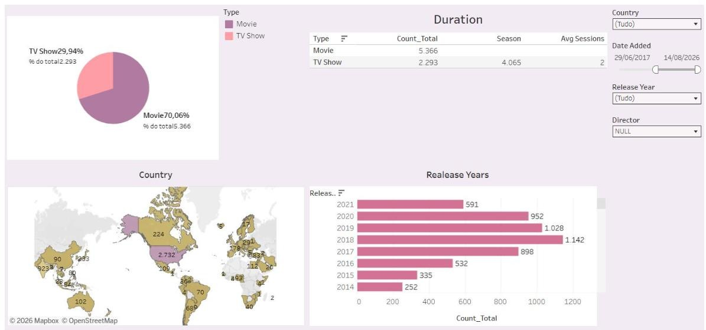

  
  
  
  

## Por que eu

A maioria dos analistas aprende a operação pelos dados. **Eu fiz o caminho contrário.** Foram mais de 16 anos conferindo cargas, controlando inventário e liderando equipes em operação de alto volume. Hoje uso **Excel, Google Sheets e Tableau** para transformar esse dia a dia em **indicadores claros, dashboards e decisões**.

> **O que isso significa para a sua empresa:** alguém que entende *por que* o número está errado antes de abrir a planilha — e que entrega a análise na linguagem de quem toma a decisão.

 

 

## Projetos em destaque

<table>
<tr>
<td width="50%" valign="top">

### ERP Financeiro — Dashboard estratégico
**Problema:** dados financeiros espalhados, sem visão de risco nem prioridade. 
**Entrega:** sistema em Google Sheets + dashboard com fluxo de caixa, gargalos, auditoria, dívidas e plano de decisões do mês. 
`Google Sheets` `Dashboard web` `IA · Claude`

[**▶ Ver demo**](https://luiscarlossoarespro-cyber.github.io/erp-financeiro-pessoal/) · [Código e documentação](https://github.com/luiscarlossoarespro-cyber/erp-financeiro-pessoal)
</td>
<td width="50%" valign="top">

### Análise de Vendas — Aurora Comercial
**Problema:** saber quem, onde e o que mais gera receita e margem. 
**Entrega:** dashboard com receita e margem por representante, dispositivo, país, categoria e gerente. 
`Excel` `Dashboard web`

[**▶ Ver demo**](https://luiscarlossoarespro-cyber.github.io/analise-vendas-online/) · [Código e documentação](https://github.com/luiscarlossoarespro-cyber/analise-vendas-online)
</td>
</tr>
<tr>
<td width="50%" valign="top">

### Catálogo Netflix — Tableau Public
**Problema:** entender a composição e a evolução de um catálogo de streaming. 
**Entrega:** dashboard interativo com filmes × séries, países, ano de lançamento e tendência mensal. 
`Tableau` `Visualização de dados`

[**▶ Abrir dashboard**](https://public.tableau.com/app/profile/lu.s.carlos.machado.soares/viz/Livro1_17865361765710/Netflix) · [Documentação](https://github.com/luiscarlossoarespro-cyber/analise-catalogo-netflix)
</td>
<td width="50%" valign="top">

### O que eu resolvo

- 📦 **Indicadores logísticos** — produtividade, acuracidade de inventário, divergências de conferência, giro e expedição
- 📊 **Dashboards gerenciais** — a informação certa, no formato certo, para quem decide
- 🧹 **Planilhas confiáveis** — organização, tratamento e padronização de dados
- ⚙️ **Rotinas mais rápidas** — automação de controles manuais com planilhas e IA
- 🔎 **Análise de gargalos** — achar onde a operação perde tempo e dinheiro

 

**Meu método em todo projeto**

`Problema` → `Perguntas` → `Dados` → `Tratamento` → `KPIs` → `Dashboard` → `Decisão`

Todos seguem o mesmo [padrão de documentação](MODELO-DE-PROJETO.md).
</td>
</tr>
</table>

## Trajetória

| Período | Empresa | Função e resultados |
|---|---|---|
| out/2026 – atual | **BBM Logística** | Conferente · conferência de cargas e descargas, separação, PDL (coletor de dados) e acuracidade das movimentações |
| dez/2021 – jun/2026 | **Coca-Cola FEMSA** | Ajudante Operacional → Assistente Geral → Assistente de Operações → **Conferente** · 100+ paletes e 29 caminhões/dia (até 40 no verão) · inventário diário do pick e geral quinzenal · coordenação de até 50 pessoas · 80+ capacitados · Kaizen e Agile |

## Ferramentas

## Formação contínua

- 🎓 Administração de Empresas · Processos Gerenciais *(cursando)*
- 📊 Técnico em Análise de Dados · SAP Professional Fundamentals *(cursando)*
- 🧩 Scrum · Excel para Análise de Dados · Intensivão de Claude

---

<b>Procuro oportunidades em Análise de Dados e Logística.</b> 
Se a sua operação gera dados e precisa de alguém que entenda o processo por trás deles, vamos conversar.  
<a href="https://www.linkedin.com/in/luiscarlos-log/"><b>LinkedIn</b></a> · <a href="mailto:luiscarlos.soarespro@gmail.com"><b>luiscarlos.soarespro@gmail.com</b></a> · <a href="https://luiscarlossoarespro-cyber.github.io/"><b>Portfólio</b></a>

